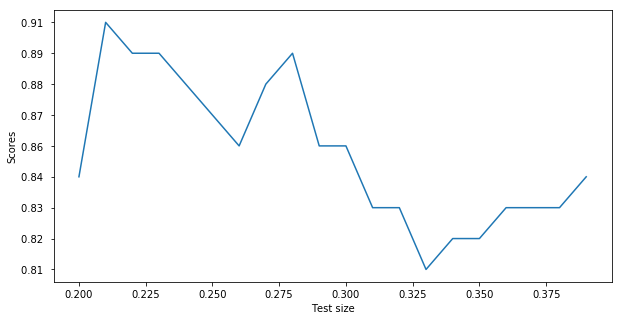
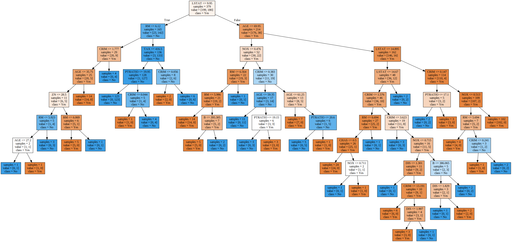
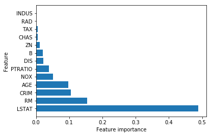
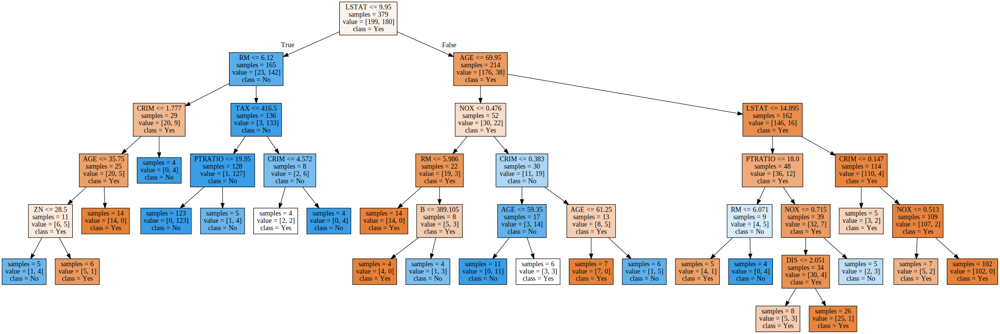
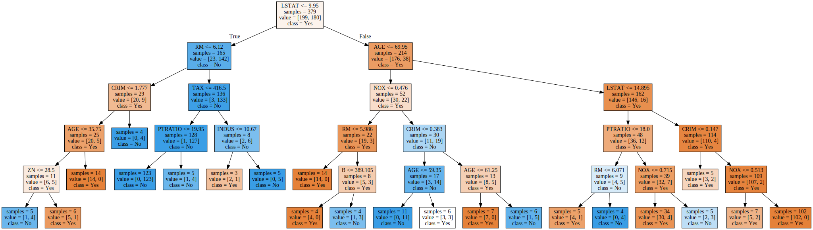
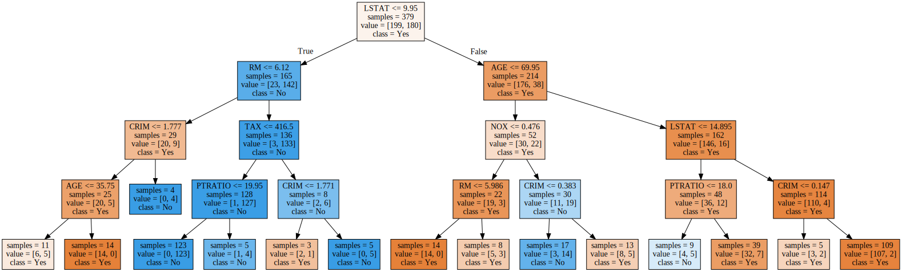
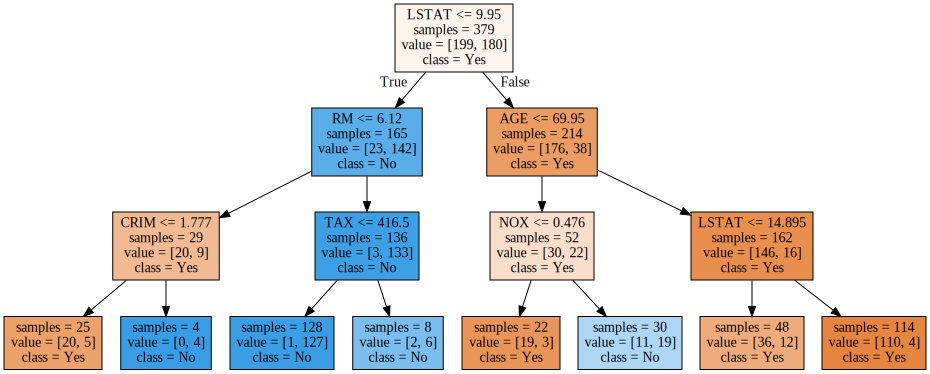
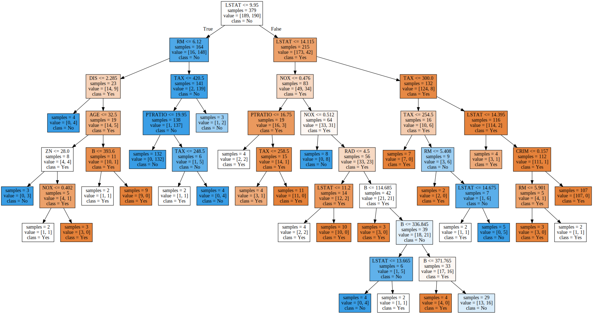
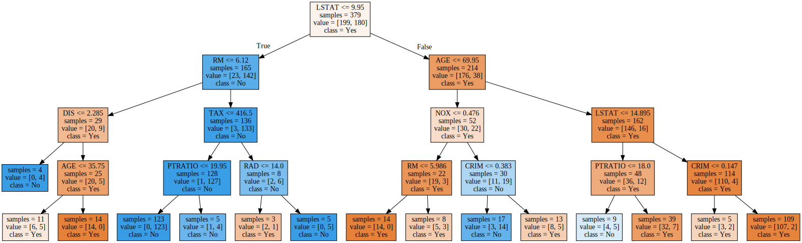
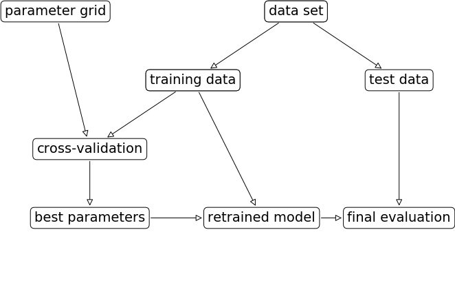

# Data models and analyses techniques: Exercise sheet 1


#### *Your name:* [Youssouf  Souare]

## Introduction

For each lecture there will be a collection of exercises presented as Jupyter notebooks. The exercises should be solved and documented as a mini-project that will form the basis for the examination. When solving the exercises it is therefore important that you 
 * document all relevant results and analyses that you have obtained/performed during the exercises.
 * try to relate your results to the theoretical background of the methods being applied. 

The documentation should be integrated (by adding new code/markdown cells) in the Jupyter notebooks containing the exercise sheets.

The mini-project should be delivered after the last seminar in this module (an exact date will be provided later) and should consist of:
 - a single pdf-file containing all the notebooks; the 'File' menu gives you the option of downloading a pdf-version of your notebook. The name of the file should be [your\_first\_name]_[your\_family\_name].pdf (e.g. Thomas\_Nielsen.pdf).
 - a copy of your notebooks with the solutions to the exercises. The notebooks should be named [your\_first name]\_[your\_family\_name]\_[exercise\_sheet\_number].ipynb (e.g., Thomas\_Nielsen\_1.ipnyb).
 
If you have any questions about the exercises, you are strongly encouraged to post you questions on the discussion forum on Moodle.

Last, but not least:
* Looking for an overview of the markdown language? The cheat sheet <a href="https://medium.com/ibm-data-science-experience/markdown-for-jupyter-notebooks-cheatsheet-386c05aeebed">here</a> might help.
* For the Python specific components of the exercises, you should not need constructs beyond those that are already included in the notebooks on the course's web-page (still you should not feel constrained by these, so feel free to be adventurous). You may, however, need to consult the documentation for some of the methods supplied by `sklearn`.

# Exercises

We shall once again play around with the Boston housing data set


```python
import numpy as np
import pandas as pd
import seaborn  as sns
import time
import random
import mglearn
from matplotlib import  pyplot as plt
from sklearn.model_selection import  train_test_split, cross_val_score, cross_val_predict
from sklearn.tree import DecisionTreeClassifier
# added
from sklearn.tree import export_graphviz
import graphviz
from sklearn.svm import  SVC

from sklearn import metrics

%matplotlib inline
#%matplotlib notebook

```


```python
# load boston dataset
from sklearn.datasets import load_boston
data = load_boston()
```


```python
# Check data description

print(data['DESCR'][:2000])
```

    Boston House Prices dataset
    ===========================
    
    Notes
    ------
    Data Set Characteristics:  
    
        :Number of Instances: 506 
    
        :Number of Attributes: 13 numeric/categorical predictive
        
        :Median Value (attribute 14) is usually the target
    
        :Attribute Information (in order):
            - CRIM     per capita crime rate by town
            - ZN       proportion of residential land zoned for lots over 25,000 sq.ft.
            - INDUS    proportion of non-retail business acres per town
            - CHAS     Charles River dummy variable (= 1 if tract bounds river; 0 otherwise)
            - NOX      nitric oxides concentration (parts per 10 million)
            - RM       average number of rooms per dwelling
            - AGE      proportion of owner-occupied units built prior to 1940
            - DIS      weighted distances to five Boston employment centres
            - RAD      index of accessibility to radial highways
            - TAX      full-value property-tax rate per $10,000
            - PTRATIO  pupil-teacher ratio by town
            - B        1000(Bk - 0.63)^2 where Bk is the proportion of blacks by town
            - LSTAT    % lower status of the population
            - MEDV     Median value of owner-occupied homes in $1000's
    
        :Missing Attribute Values: None
    
        :Creator: Harrison, D. and Rubinfeld, D.L.
    
    This is a copy of UCI ML housing dataset.
    http://archive.ics.uci.edu/ml/datasets/Housing
    
    
    This dataset was taken from the StatLib library which is maintained at Carnegie Mellon University.
    
    The Boston house-price data of Harrison, D. and Rubinfeld, D.L. 'Hedonic
    prices and the demand for clean air', J. Environ. Economics & Management,
    vol.5, 81-102, 1978.   Used in Belsley, Kuh & Welsch, 'Regression diagnostics
    ...', Wiley, 1980.   N.B. Various transformations are used in the table on
    pages 244-261 of the latter.
    
    The Boston house-price data has been used in many machine learning papers that address regression
    problems.   
         
    **References**
    
       - Belsley, Kuh & Welsch, 'Regressi
    

Again we treat it as a classification problem:


```python
# split  data into training and test dataset.
X = data['data']
y = c =  np.array([1 if y > np.median(data['target']) else 0 for y in data['target']])
X_train, X_test, c_train, c_test = train_test_split(data['data'], c, random_state= 110)
```

## Model learning
* Learn a decision tree using the training data and evaluate its performance on both the training data and the test data. Generate random training/test partitions or varying sizes and analyze how the accuracy results vary (consult the documentation for `train_test_split(.)`).

### Learn the decision tree and evaluate the performance


```python
# check the training and test data size.

print("number of datapoints in training set and test, respectively :\n {} and {}"
      .format(X_train.shape[0], X_test.shape[0]))
```

    number of datapoints in training set and test, respectively :
     379 and 127
    


```python
# Create an instance of decision tree classifier with random state 110

seed = 110
my_tree = DecisionTreeClassifier( random_state = seed)

# learn a tree decison using training data and call fit method.

my_tree.fit(X_train, c_train)

```


    DecisionTreeClassifier(class_weight=None, criterion='gini', max_depth=None,
                max_features=None, max_leaf_nodes=None,
                min_impurity_decrease=0.0, min_impurity_split=None,
                min_samples_leaf=1, min_samples_split=2,
                min_weight_fraction_leaf=0.0, presort=False, random_state=110,
                splitter='best')


```python
# print accuracy on both training and test set.
print("Accuracy on the original data: {:.2f}".format(my_tree.score(X_train,c_train)))
print("Accuracy on the test data:{:.2f}".format(my_tree.score(X_test,c_test)))   
      
```

    Accuracy on the original data: 1.00
    Accuracy on the test data:0.87
    

 One can also  achieve these results by performing the following computations on both training set and test set.


```python
# performance of training data

train_pred = my_tree.predict(X_train)
print("Training set prediction is :  \n {}".format(train_pred))
```

    Training set prediction is :  
     [0 0 1 1 0 0 1 1 0 0 0 1 1 0 0 0 1 1 0 0 1 1 0 1 1 0 1 1 1 0 0 0 0 1 1 1 1
     0 0 1 0 0 1 1 0 1 0 0 0 1 0 0 0 0 0 0 0 0 1 0 0 1 0 0 0 1 1 1 1 1 0 0 1 1
     0 1 0 1 1 0 1 0 0 0 0 0 1 0 0 1 0 0 1 1 1 0 0 1 0 1 0 1 1 0 1 0 0 1 0 0 0
     1 1 0 0 0 1 0 1 0 0 0 1 1 1 0 0 1 0 1 1 0 0 0 1 0 0 0 1 0 1 1 0 1 1 1 1 1
     0 0 1 1 1 1 0 1 1 1 0 0 1 1 1 0 1 0 1 0 1 1 1 0 1 1 1 0 1 0 0 0 1 0 0 1 1
     0 0 0 1 0 1 1 1 1 1 1 0 0 1 0 1 1 1 1 1 0 0 1 0 0 1 1 1 0 0 0 1 0 0 0 1 0
     0 0 1 0 1 0 0 1 1 1 1 1 0 1 0 1 1 1 1 1 1 0 1 1 0 1 1 0 1 0 0 1 1 0 1 1 1
     1 1 0 0 0 0 0 0 0 0 0 1 1 1 0 1 0 1 0 0 0 1 0 0 0 1 0 1 0 0 1 0 0 0 0 1 0
     0 0 0 0 1 1 1 1 0 0 0 1 1 0 1 0 0 1 0 1 1 0 1 0 0 0 1 0 1 1 0 0 0 1 0 0 1
     1 0 0 1 0 0 1 1 0 0 1 0 0 0 0 0 0 0 1 0 1 0 1 1 1 0 1 1 0 0 0 1 1 1 0 1 1
     1 0 0 0 0 1 0 1 0]
    


```python
print("Test set score: {:.2f}".format(np.mean(train_pred == c_train)))

```

    Test set score: 1.00
    


```python
# Performance of test data

test_pred  = my_tree.predict(X_test)

print("Test set predictions:\n {}".format(test_pred))
```

    Test set predictions:
     [0 0 0 1 1 0 1 1 1 1 1 1 0 1 0 0 1 0 1 0 1 1 1 1 0 0 1 1 0 1 0 1 0 0 1 1 0
     1 1 0 0 0 0 1 1 1 0 1 0 1 0 0 1 0 1 0 0 1 0 0 1 0 1 1 0 1 1 1 1 1 1 0 0 0
     0 0 0 1 0 1 1 1 0 0 0 1 1 0 1 0 0 1 0 1 0 1 1 1 0 0 0 0 1 0 1 0 1 0 0 0 1
     1 1 0 1 1 0 0 0 0 1 0 0 1 1 0 1]
    


```python
print("Test set score: {:.2f}".format(np.mean(test_pred == c_test)))
```

    Test set score: 0.87
    

### Model analysis with different test sizes
Now we try to  create an array of test size, learn the  model with different training and test sets and evaluate the performance for each model or  configuration.


```python
# This function takes test size and random state as input parameters, then split the data, build the model
# and evaluate the performance of the model.

def model_processing(test_size, random_states):
    
    #split the model
    X_train, X_test, c_train, c_test = train_test_split(data.data, c,
                                                        random_state = random_states, test_size = test_size)  
    seed = 200
    
    rand_tree = DecisionTreeClassifier(random_state=seed)  #Initializing the model
    rand_tree.fit(X_train, c_train)     
    test_size_range.append(test_size)
    scores.append("{:.2f} ".format(rand_tree.score(X_test, c_test)))
    
    #Evaluating the performance of the decision tree
    print("\nnumber of datapoints in training set: {} "
      .format(X_train.shape[0]))   
    print("number of datapoints in test set: {} "
      .format(X_test.shape[0]))    
    print("Test size: {}".format(test_size))
    print("Accuracy score on training set: {:.3f}".format(rand_tree.score(X_train, c_train)))
    print("Accuracy score on test set: {:.3f}".format(rand_tree.score(X_test, c_test))) 
    return rand_tree

```


```python
# Generate an array of test size.
for i in range (0, 20):
    if i==0:
        scores = []
        test_size_range = []
    k = round(0.20 + (i*0.01), 2) 
    model_processing(k, 42) # call the model processing method here  

plt.figure(figsize=(10,5))
plt.xlabel("Test size")
plt.ylabel("Scores")
plt.plot(test_size_range, scores)
plt.show()
```

    
    number of datapoints in training set: 404 
    number of datapoints in test set: 102 
    Test size: 0.2
    Accuracy score on training set: 1.000
    Accuracy score on test set: 0.843
    
    number of datapoints in training set: 399 
    number of datapoints in test set: 107 
    Test size: 0.21
    Accuracy score on training set: 1.000
    Accuracy score on test set: 0.907
    
    number of datapoints in training set: 394 
    number of datapoints in test set: 112 
    Test size: 0.22
    Accuracy score on training set: 1.000
    Accuracy score on test set: 0.893
    
    number of datapoints in training set: 389 
    number of datapoints in test set: 117 
    Test size: 0.23
    Accuracy score on training set: 1.000
    Accuracy score on test set: 0.889
    
    number of datapoints in training set: 384 
    number of datapoints in test set: 122 
    Test size: 0.24
    Accuracy score on training set: 1.000
    Accuracy score on test set: 0.877
    
    number of datapoints in training set: 379 
    number of datapoints in test set: 127 
    Test size: 0.25
    Accuracy score on training set: 1.000
    Accuracy score on test set: 0.874
    
    number of datapoints in training set: 374 
    number of datapoints in test set: 132 
    Test size: 0.26
    Accuracy score on training set: 1.000
    Accuracy score on test set: 0.864
    
    number of datapoints in training set: 369 
    number of datapoints in test set: 137 
    Test size: 0.27
    Accuracy score on training set: 1.000
    Accuracy score on test set: 0.883
    
    number of datapoints in training set: 364 
    number of datapoints in test set: 142 
    Test size: 0.28
    Accuracy score on training set: 1.000
    Accuracy score on test set: 0.887
    
    number of datapoints in training set: 359 
    number of datapoints in test set: 147 
    Test size: 0.29
    Accuracy score on training set: 1.000
    Accuracy score on test set: 0.857
    
    number of datapoints in training set: 354 
    number of datapoints in test set: 152 
    Test size: 0.3
    Accuracy score on training set: 1.000
    Accuracy score on test set: 0.862
    
    number of datapoints in training set: 349 
    number of datapoints in test set: 157 
    Test size: 0.31
    Accuracy score on training set: 1.000
    Accuracy score on test set: 0.834
    
    number of datapoints in training set: 344 
    number of datapoints in test set: 162 
    Test size: 0.32
    Accuracy score on training set: 1.000
    Accuracy score on test set: 0.827
    
    number of datapoints in training set: 339 
    number of datapoints in test set: 167 
    Test size: 0.33
    Accuracy score on training set: 1.000
    Accuracy score on test set: 0.808
    
    number of datapoints in training set: 333 
    number of datapoints in test set: 173 
    Test size: 0.34
    Accuracy score on training set: 1.000
    Accuracy score on test set: 0.815
    
    number of datapoints in training set: 328 
    number of datapoints in test set: 178 
    Test size: 0.35
    Accuracy score on training set: 1.000
    Accuracy score on test set: 0.820
    
    number of datapoints in training set: 323 
    number of datapoints in test set: 183 
    Test size: 0.36
    Accuracy score on training set: 1.000
    Accuracy score on test set: 0.825
    
    number of datapoints in training set: 318 
    number of datapoints in test set: 188 
    Test size: 0.37
    Accuracy score on training set: 1.000
    Accuracy score on test set: 0.830
    
    number of datapoints in training set: 313 
    number of datapoints in test set: 193 
    Test size: 0.38
    Accuracy score on training set: 1.000
    Accuracy score on test set: 0.834
    
    number of datapoints in training set: 308 
    number of datapoints in test set: 198 
    Test size: 0.39
    Accuracy score on training set: 1.000
    Accuracy score on test set: 0.838
    





The results of this computation are resumed in the following table

|Test Size | Accuracy on Train | Accuracy on Test| Train set| Test set                      
|:----------|:------------|:--------|:-----------|:----------|
|0.2       |1.000        |0.843     | 404   | 102    
|0.21      | 1.00        |0.907     |399    | 107
|0.22      | 1.00        |0.893     |394    | 112
|0.23      | 1.000       |0.889     |389   |117
|0.24      | 1.000       | 0.877    |384   | 122
|0.25      | 1.000       |0.874     |379   | 127
|0.26      | 1.000       |0.864     |374   | 132
|0.27      | 1.000       |0.883     |369  | 137
|0.28      | 1.000       |0.887     |364   | 142
|0.29      | 1.000       |0.857     |359   | 147
|0.3       | 1.000       | 0.862    |354   | 152   |
|0.31      | 1.000       |0.834     |349    | 157
|0.32      | 1.00        |0.827     |344     | 162
|0.33      | 1.00        |0.808     |339   | 167   |
|0.34      | 1.000       |0.815     |333    | 173  |
|0.35      | 1.000       |0.820     |328   | 178   |
|0.36      | 1.000       |0.825     |318   | 188  |
|0.37      | 1.000       |0.830     |323   | 183
|0.38      | 1.000       |0.834     |313   | 193  |
|0.39      | 1.000       |0.838     |308  | 198   |


### Analysis of different configurations

From the table and  graph, on can see that the best accuray score on test set is achieved with `test_size = 0.21` and training accuracy is always 100% which can  be  a sign of overfitting the data. 

## Model analysis

* Display the decision tree learned using the training data.
* What are the most important features as determined by the learned tree and does, e.g., the choice of top node seem reasonable to you based on your knowledge of the data domain?
* How does the features deemed *most important* by the decision tree learner match the generated tree and your understanding of the domain?

### Display the decision tree learned using the training dataset


```python
# Display the decision tree learned using the training dataset
my_tree = DecisionTreeClassifier(random_state= 110)
my_tree.fit(X_train, c_train)


export_graphviz(my_tree, out_file="tree.dot", class_names=["Yes", "No"],
                feature_names=data.feature_names, impurity=False, filled=True)

with open("tree.dot") as f:
    dot_graph = f.read()
display(graphviz.Source(dot_graph))
#graphviz.Source(dot_graph)
```





### Inspection of feature importance


```python
# Print feature importances
print("Feature importances:\n{}".format(my_tree.feature_importances_))
```

    Feature importances:
    [ 0.10555076  0.01157462  0.          0.00488339  0.05047619  0.15448967
      0.09657179  0.02278053  0.          0.00467281  0.03941855  0.02075829
      0.48882339]
    


```python
# plot feature importance
def plot_feature_importances_boston(model):
    n_features = data.data.shape[1] # number of columns of training data
    feat_importance = my_tree.feature_importances_
    feat_indices = np.argsort(feat_importance)[::-1] # ascendance order of indices
    plt.barh(range(n_features), feat_importance[feat_indices], align='center')    
    
    plt.yticks(np.arange(n_features), data.feature_names[ feat_indices])
    plt.xlabel("Feature importance")
    plt.ylabel("Feature")
    plt.ylim(-1, n_features)

plot_feature_importances_boston(my_tree)
```





```python
# Print the feature importances
feat_importance = my_tree.feature_importances_
print(feat_importance)
feat_indices = np.argsort(feat_importance)[::-1]
print(feat_indices)
feat_indices2 = np.argsort(feat_importance)[:-1]
print(feat_indices2)


print("Feature ranking:")

for f in range(X_train.shape[1]):
       
    print(" {}. feature {} ({:.4f}) {}" .format(f + 1,feat_indices[f],feat_importance[feat_indices[f]],
                                            data.feature_names[feat_indices[f]]))

```

    [ 0.10555076  0.01157462  0.          0.00488339  0.05047619  0.15448967
      0.09657179  0.02278053  0.          0.00467281  0.03941855  0.02075829
      0.48882339]
    [12  5  0  6  4 10  7 11  1  3  9  8  2]
    [ 2  8  9  3  1 11  7 10  4  6  0  5]
    Feature ranking:
     1. feature 12 (0.4888) LSTAT
     2. feature 5 (0.1545) RM
     3. feature 0 (0.1056) CRIM
     4. feature 6 (0.0966) AGE
     5. feature 4 (0.0505) NOX
     6. feature 10 (0.0394) PTRATIO
     7. feature 7 (0.0228) DIS
     8. feature 11 (0.0208) B
     9. feature 1 (0.0116) ZN
     10. feature 3 (0.0049) CHAS
     11. feature 9 (0.0047) TAX
     12. feature 8 (0.0000) RAD
     13. feature 2 (0.0000) INDUS
    


```python
feat_indices = np.argsort(feat_importance)[::-1]
 
feat_name2 = data.feature_names[ feat_indices]
feat_name2
```


    array(['LSTAT', 'RM', 'CRIM', 'AGE', 'NOX', 'PTRATIO', 'DIS', 'B', 'ZN',
           'CHAS', 'TAX', 'RAD', 'INDUS'],
          dtype='<U7')


```python
print(np.argsort(my_tree.feature_importances_)[::-1])   
```

    [12  5  6  7  0  4 11  1  8  3  9 10  2]
    

### Analysing of Important features
From the graph and ranking table, one can see that the most important feature is `LSTAT`. This is the feature that contains the most of the variablity of the data. So the choice of the top tree is reasonable for me.

## Model complexity
* Try controlling the complexity of the learned decision tree by adjusting the parameters max\_depth, min\_samples\_split, min\_samples\_leaf
* Investigate the effect when changing these parameters:
    - Visualize (some of) the trees
    - Evaluate the performance of the models on both the training data and the test data
* By designating part of the data as *validation data*, try to automatically find good values for the parameters controlling the size of the tree. How does the obtained parameters match your manual investigation?
* Instead of using a validation set, try to find good parameter values using cross-validation. How does the results compare to those that you found above?

### Control tree complexity

One can see that the built tree  is complex and is overfitting according to its training accuracy score. In order to reduce the complexecity we can control the size of tree by controlling some of its parameters such as `max_depth`
`min_samples_split ` and `min_samples_leaf`. In what follws, we willimplement a function that will take these parameters as input and build the model for each combination of these parameters.


```python
# This function will take the  different
# parameters and print the performances of different configurations.
seed = 110
def analyzeDecisionTreePerformance(_maxDepth, minSamplesSplit, minSamplesLeaves):
    treeModel = DecisionTreeClassifier(random_state=seed, max_depth=_maxDepth,
                                       min_samples_split=minSamplesSplit, min_samples_leaf= minSamplesLeaves)
    model = treeModel.fit(X_train, c_train) 
    
    
    #And check the accuracy again    
    print("\n")
    print("Accuracy on training set: {:.3f}".format(treeModel.score(X_train, c_train)))
    print("Accuracy on test set: {:.3f}".format(treeModel.score(X_test, c_test)))
    return model
   
```


```python
def VisualizeTree(treeModel, features, class_name):
    from sklearn.tree import export_graphviz
    import graphviz
    export_graphviz(treeModel, out_file="tree.dot", class_names= class_name,
                feature_names=features, impurity=False, filled=True)
    with open("tree.dot") as f:
        dot_graph = f.read()
        display(graphviz.Source(dot_graph))
```

### Visualize some trees and evaluate the performances


```python
max_depth = [6,5, 4, 3, 3]
min_samples_split = [5,2,2, 3, 2]
min_samples_leaf = [4, 3, 3, 2, 3]

for depth, min_split, min_leaf in zip(max_depth, min_samples_split, min_samples_leaf):
    model = analyzeDecisionTreePerformance(depth, min_split, min_leaf)
    feature_names = data.feature_names
    class_names=["Yes", "No"]
    
    print("\n")
    print("max_depth: {}\nmin_samples_split: {} \nmin_samples_leaf: {}"
           .format(depth, min_split, min_leaf))
        
    
    VisualizeTree(model, feature_names, class_names)
```

    
    
    Accuracy on training set: 0.945
    Accuracy on test set: 0.858
    
    
    max_depth: 6
    min_samples_split: 5 
    min_samples_leaf: 4
    





    
    
    Accuracy on training set: 0.947
    Accuracy on test set: 0.866
    
    
    max_depth: 5
    min_samples_split: 2 
    min_samples_leaf: 3
    





    
    
    Accuracy on training set: 0.913
    Accuracy on test set: 0.850
    
    
    max_depth: 4
    min_samples_split: 2 
    min_samples_leaf: 3
    





    
    
    Accuracy on training set: 0.900
    Accuracy on test set: 0.835
    
    
    max_depth: 3
    min_samples_split: 3 
    min_samples_leaf: 2
    





    
    
    Accuracy on training set: 0.900
    Accuracy on test set: 0.835
    
    
    max_depth: 3
    min_samples_split: 2 
    min_samples_leaf: 3
    


```python
max_depth = 4
min_samples_split = 2
min_samples_leaf = 3

feature_names = data.feature_names
class_names=["Yes", "No"]

# We have :

model = analyzeDecisionTreePerformance(max_depth, min_samples_split, min_samples_leaf)
VisualizeTree(model, feature_names, class_names)

```

    
    
    Accuracy on training set: 0.913
    Accuracy on test set: 0.850
    


### Summary

One can summarize these result in the following table:


|Depth |min_samples_split | min_samples_leaf| Train set| Test set                      
|:----------|:------------|:--------|:-----------|:----------|
|3      |2        |3     | 0.884   | 0.795  |
|4      |2        |3     |0.915   | 0.827   |
|5      |2        |3     |0.930    | 0.827   |
|6      |5        |4     |0.937   | 0.819   |
|3      |3       |2     |0.884   |0.795  |

From  this table,  one can  see that  the combination `4, 2, 3 `  and `5, 2, 3` provid the best scores.
In the section we will try to investigate some methods more robusts to determine the best combination of the parameters
for the best score. We will start by  ** Validation data ** and then we will go to ** Cross-validation **.

### Validation Data


```python
seed = 200
#Split the data set into validation, training and test sets
X_trainVal, X_test, c_trainVal, c_test= train_test_split(data.data,
                                                         c, random_state=seed, test_size = 0.25)

#Split the trainValidation set into validation and training test sets
X_train, X_validation, c_train, c_validation= train_test_split(X_trainVal,
                                                               c_trainVal, random_state=seed, test_size = 0.25)

#finding the best combination of parameters

def DTPerformance_with_validation():
    best_score = 0 
    best_parameters = {}
    
    #Iterate to find the best score
    for depth in range(1, 10):
        for sampleSplit in range(2, 11):
            for sampleLeaves in range (1, 10): 
                treeModel = DecisionTreeClassifier(random_state=seed, 
                                                   max_depth=depth, min_samples_split = sampleSplit,
                                                   min_samples_leaf=sampleLeaves)
                model = treeModel.fit(X_train, c_train)
                score = model.score(X_validation, c_validation)
                if score > best_score: 
                    best_score = score             
                     
                    best_parameters = {"Best score: {:.2f} , Depth: {} , SampleLeaves: {}, sampleSplit: {}"
                                       .format(best_score, depth, sampleLeaves, sampleSplit)}
                    #print(model)
    print("Combination of best parameters: {}". format(best_parameters))
    

DTPerformance_with_validation()

```

    Combination of best parameters: {'Best score: 0.86 , Depth: 8 , SampleLeaves: 2, sampleSplit: 5'}
    

Knowing the best parameters one can build, learn tree and evaluate its performance.


```python
#Rebuild the model based on the training && validation set
depth = 8
sample_leaves = 2
sample_split = 5

treeModel = DecisionTreeClassifier(random_state=seed, max_depth= depth, min_samples_split= sample_split,
                                  min_samples_leaf = sample_leaves)
model = treeModel.fit(X_trainVal, c_trainVal)

#Evaluate the results
score = model.score(X_test, c_test)
print("Accuracy on test set: {:.3f}".format(score)) 
print("Accuracy on train set: {:.3f}". format(model.score(X_trainVal, c_trainVal)))

#Visualize the tree
#showTree(treeModel)
feature_names = data.feature_names
class_names=["Yes", "No"]
VisualizeTree(model, feature_names, class_names)
```

    Accuracy on test set: 0.843
    Accuracy on train set: 0.931
    





### Summary Validation Data

From the algorithm, one can see that the complexecity of the tree is still heigh because of the `max_depth = 8 `. We  can however still use these parameters to build, learn the decision tree classifier and evaluate its performance. In the step we will investigate how we can use the `cross-validation` to find the best combination of the parameters, which can reduce the complexicity of  the tree.

### Cross-vslidation

### Using Cross-validation 


```python
X = data['data']
y = c =  np.array([1 if y > np.median(data['target']) else 0 for y in data['target']])
X_trainval, X_test, y_trainval, y_test = train_test_split(data['data'], c, random_state=110)

print("Size of training set:{}".format(X_train.shape[0]))
print("Size of test set:{}".format(X_test.shape[0]))

```

    Size of training set:284
    Size of test set:127
    


```python

def DTPerformance_cross_validation():
    best_score = 0 
    best_parameters = {}
    
    #Iterate to find the best score
    for depth in range(1, 10):
        for sampleSplit in range(2, 11):
            for sampleLeaves in range (1, 10): 
                treeModel = DecisionTreeClassifier(random_state=seed, 
                                                   max_depth=depth, min_samples_split = sampleSplit,
                                                   min_samples_leaf=sampleLeaves)              
                score = cross_val_score(treeModel, X_trainval, y_trainval, cv=5)
                score = score.mean()
                if score > best_score:
                    best_score = score
                    
                    best_parameters = {"Best score: {:.2f} , Depth: {} , SampleLeaves: {}, sampleSplit: {}"
                                       .format(best_score, depth, sampleLeaves, sampleSplit)}            
            
                    
    print("Combination of best parameters: {}". format(best_parameters))
    
        

```


```python
DTPerformance_cross_validation()
```

    Combination of best parameters: {'Best score: 0.85 , Depth: 4 , SampleLeaves: 3, sampleSplit: 2'}
    


```python
depth = 4
sample_leaves = 3
sample_split = 2
seed = 200

model  = DecisionTreeClassifier(random_state= seed, max_depth= depth,
                                min_samples_split= sample_split, min_samples_leaf = sample_leaves)
model.fit(X_trainval, y_trainval)

print("Score on training/validation set: {:.3f}".format(model.score(X_trainval, y_trainval)))
print("Score on test set: {:.3f}".format(model.score(X_test, y_test)))

feature_names = data.feature_names
class_names=["Yes", "No"]
VisualizeTree(model, feature_names, class_names)

```

    Score on training/validation set: 0.913
    Score on test set: 0.858
    





The diagram of cross-validation can be found below:


```python
mglearn.plots.plot_grid_search_overview()
```





### Summary
With the combination provided by `cross-validation`, we have a better control on complexicity and the performance of the model. We achieved the same results by using manual manupulation to find the best combination, however the time to achieve the same are not comparable.
