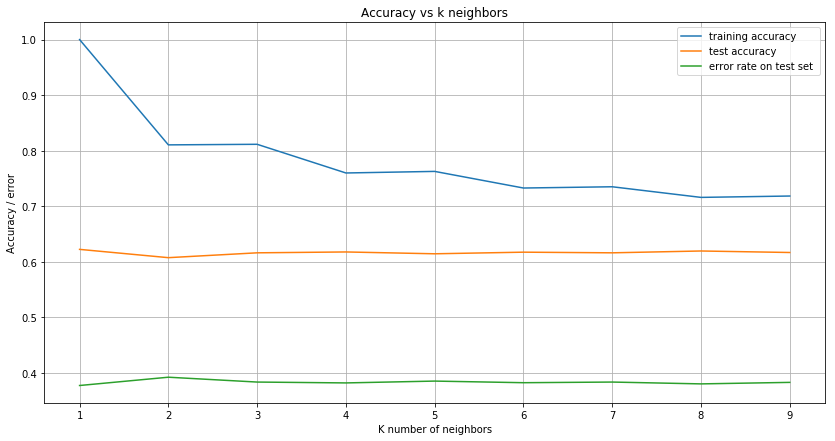
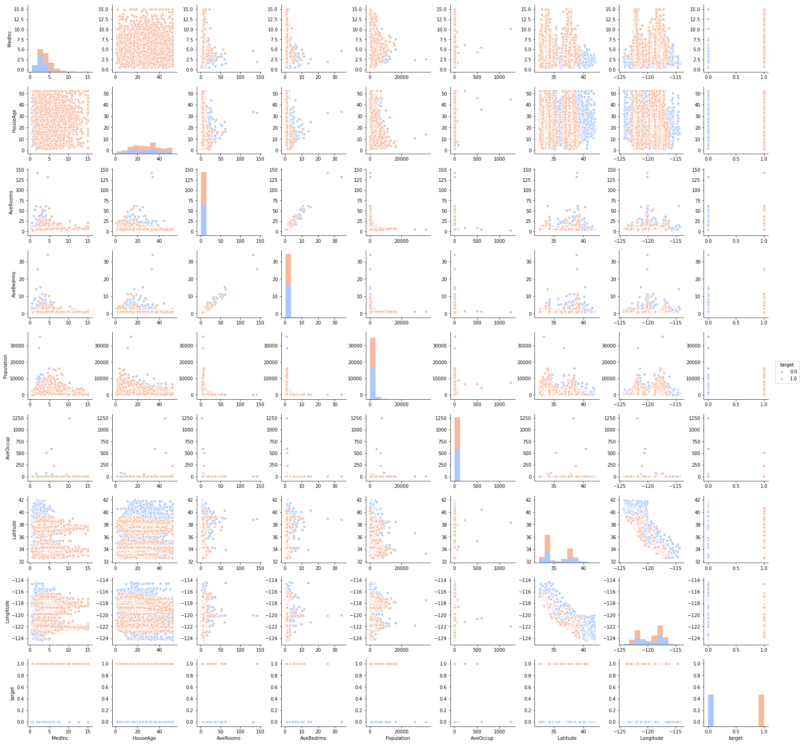
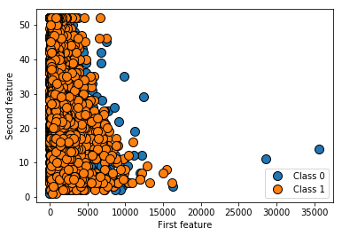
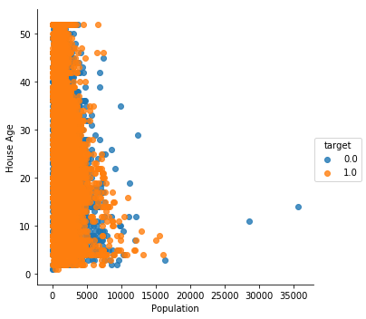
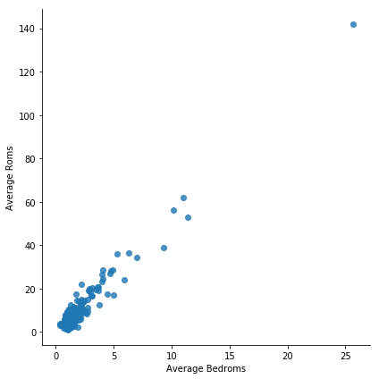
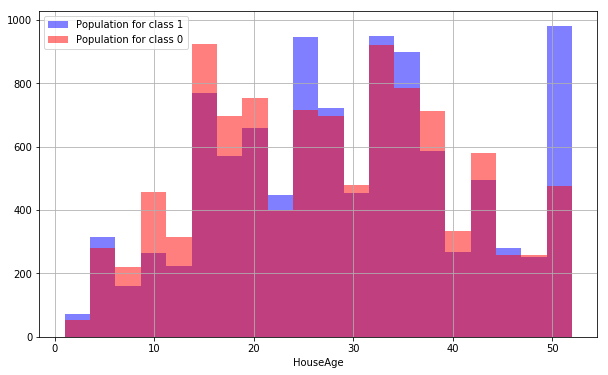
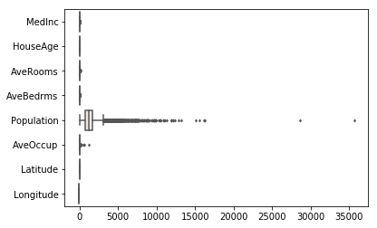
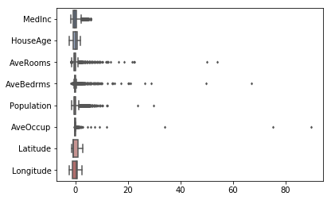
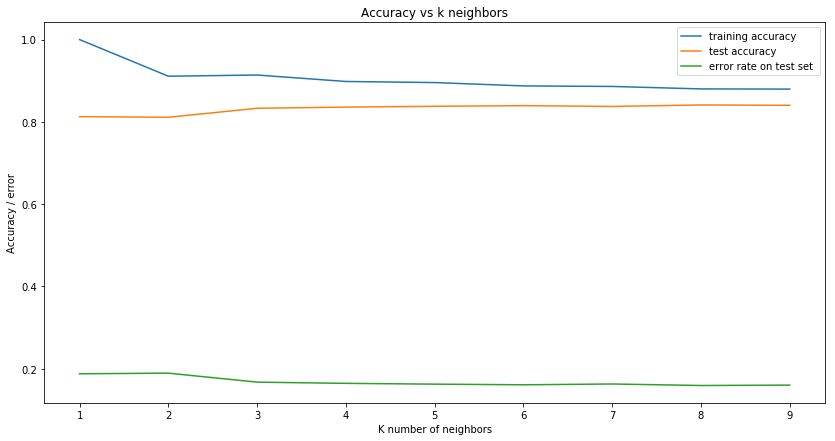
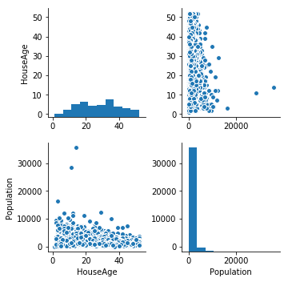

# Data models and analyses techniques: Exercise sheet 2

#### *Your name:* [Youssouf Souare]

## Exercises

In this exercise we shall expore and compare the k-nearest neighbor classifier and the naive Bayes model. The analysis will be based on the *California housing* data set.


```python
from sklearn.datasets import fetch_california_housing
data = fetch_california_housing()

```


```python
import numpy as np
from sklearn.model_selection import train_test_split
c = np.array([1 if y > np.median(data['target']) else 0 for y in data['target']])
X_train, X_test, c_train, c_test = train_test_split(data['data'], c, random_state=0)

```

### K-nearest neighbor
* Classify the instances in the test set using default settings for the k-NN classifier.
* Try experimenting with different values for 'k'. How do the values affect the classification results? Feel free to try to automate this process using the methods explored in the previous exercise sheet. 
* Try to get some more insight into the data by generating descriptive statistics and by plotting the data. 
* Based on your understanding of the data and the properties of the k-NN classifier, does it seem reasonable to try to manipulate the data (e.g. through normalization) or work with different distance metrics in order to improve the performance of the classifier? How does such changes affect classification accuracy?

### Naive Bayes

* Classify the instances in the test set using the naive Bayes model.
* The naive Bayes classifier makes the strong assumption that the attributes are conditionally independent given the class variable. Can you identify any pairs of attributes that do not adhere to this assumption, and how does it affect the performance of the classifier if one of the attributes are removed?

### Model comparison

* Using the results obtained above, classify the instances in the test set using the k-NN classifier, the naive Bayes classifier, and decision trees.
* Based on your intuitive understanding of the classifiers, can you explain their relative performance? 


```python
# added
import pandas as pd
import numpy as np
import matplotlib.pyplot as plt
import seaborn as sns
import mglearn
import time
import math
import matplotlib.mlab as mlab
from IPython.display import display
from sklearn.neighbors import KNeighborsClassifier
from sklearn.tree import  DecisionTreeClassifier
from sklearn.metrics import  classification_report, confusion_matrix
from sklearn.naive_bayes import  GaussianNB
%matplotlib inline
```

# Exercise sheet 2  Answers

## K-nearest neighbor


```python
# K-nearest neighbor classifier using default parameters.

# Create an instance of k-nn classifier.
knn = KNeighborsClassifier()

```


```python
# learn the model
knn.fit(X_train, c_train)
```


    KNeighborsClassifier(algorithm='auto', leaf_size=30, metric='minkowski',
               metric_params=None, n_jobs=1, n_neighbors=5, p=2,
               weights='uniform')


```python
# Compute the accuracy on training and test set.
print( "The Accuracy on test set is : {:.2f}" .format(knn.score(X_test, c_test)))
print("Accuracy on train set is : {:.2f}" .format(knn.score(X_train, c_train)))
```

    The Accuracy on test set is : 0.61
    Accuracy on train set is : 0.76
    


```python
# One can also use confusion matrix and classification report
# to see how the model is performing the data.

pred_test = knn.predict(X_test) # Compute the prediction
cm = confusion_matrix(c_test, pred_test) # confusion matrix

print("Confusion Matrix \n {}".format(cm))
print("\n")
cr = classification_report(c_test, pred_test) # classification report
print("classifcation report: \n {}". format(cr))

```

    Confusion Matrix 
     [[1613 1025]
     [ 964 1558]]
    
    
    classifcation report: 
                  precision    recall  f1-score   support
    
              0       0.63      0.61      0.62      2638
              1       0.60      0.62      0.61      2522
    
    avg / total       0.61      0.61      0.61      5160
    
    

Now we perform some experiments with different values of k neighbors.
To do so, we write a fucntion that takes a range of k-neighbors, build the model for each configuration, and visualize the training accuracy,test accuracy and error rate.


```python

# The function takes a number of k-neighbors and for each value of k, a model is created then 
# the accuracy on training, accuracy on test set and the error rate are printed.
    
def KNeighborsAccuracyAndErrorRate(rang_neighbors):
    
    
    training_accuracy = [] # training accuracy
    test_accuracy = [] # test accuracy
    error_rate_list = [] # error rate
    neighbors_settings = range(1, rang_neighbors) # neighbors range settings.
    
   
    for n_neighbors in neighbors_settings:        
        
          
        # build the knn model for each neighbor in neighbor set
        clf = KNeighborsClassifier(n_neighbors=n_neighbors)
        clf.fit(X_train, c_train)
        # record training set accuracy
        training_accuracy.append(clf.score(X_train, c_train))
        # record  test set accuracy
        test_accuracy.append(clf.score(X_test, c_test))
        # record error rate on  test set
        error_rate_list.append(np.mean(clf.predict(X_test) != c_test))         
       
        print("\nK =", n_neighbors)
        print("Accuracy score on training set: {:.2f}"
              .format(clf.score(X_train, c_train)))        
        print("Accuracy score on test set: {:.2f}\n"
              .format(clf.score(X_test, c_test)))
        
    ## plot the different results.
    fig, axes = plt.subplots(figsize=(14,7)) 
    axes.plot(neighbors_settings, training_accuracy, label="training accuracy") 
    axes.plot(neighbors_settings, test_accuracy, label="test accuracy")
    axes.plot(neighbors_settings, error_rate_list, label="error rate on test set ")
    axes.set_ylabel("Accuracy / error")
    axes.set_xlabel("K number of neighbors")
    axes.set_title("Accuracy vs k neighbors")
    axes.legend()
    axes.grid()
    
    
    
```


```python
KNeighborsAccuracyAndErrorRate(10) # call the function for the first k neighbors.
```

    
    K = 1
    Accuracy score on training set: 1.00
    Accuracy score on test set: 0.62
    
    
    K = 2
    Accuracy score on training set: 0.81
    Accuracy score on test set: 0.61
    
    
    K = 3
    Accuracy score on training set: 0.81
    Accuracy score on test set: 0.62
    
    
    K = 4
    Accuracy score on training set: 0.76
    Accuracy score on test set: 0.62
    
    
    K = 5
    Accuracy score on training set: 0.76
    Accuracy score on test set: 0.61
    
    
    K = 6
    Accuracy score on training set: 0.73
    Accuracy score on test set: 0.62
    
    
    K = 7
    Accuracy score on training set: 0.74
    Accuracy score on test set: 0.62
    
    
    K = 8
    Accuracy score on training set: 0.72
    Accuracy score on test set: 0.62
    
    
    K = 9
    Accuracy score on training set: 0.72
    Accuracy score on test set: 0.62
    
    





The parameters can also be seen in following  table.

|K-neighbors | Accuracy on Train | Accuracy on Test|                      
|:----------|:------------|:--------|
|1         |1.000        |0.62     |               
|2      | 0.81        |0.61    |
|3      | 0.81       |0.62     |
|4      | 0.76      |0.62    |
|5      | 1.76      | 0.61    |
|6      | 0.73       |0.62     |
|7      | 0.74      |0.62     |
|8      | 0.72       |0.62     |
|9      | 0.72      |0.62     |
|10      | 0.70       |0.62     |
|11       | 0.71       | 0.62    |
|12      | 0.70       |0.61     |
|13      | 0.70       |0.62     |
|14      | 0.68       |0.61     |
|15      | 0.69       |0.62     |
|16      | 0.68       |0.61     |
|17      | 0.68       |0.61     |
|18      | 0.67       |0.61     |
|19      | 0.67      |0.61     |
 


### Analysis of model on k-values

After some experiments on the number of `k-neighbors`, one can see that the maximum score was already  achieve  for `k = 3`. So we can conlude that there is no need to experiment more than `k = 5`.

### Now it is time  to perform some  exploratory Data Analysis (EDA)


```python
# For the sake of simplicity, we just transfor the dataset into pandas data frame
# then perform som  exploratory data analysis.

data['target'] = c

c_housing = pd.DataFrame( data = np.c_[data['data'], c],
                             columns= data['feature_names']+ ['target'])

```


```python
# See the number of columns or features and target.

print(c_housing.columns)
```

    Index(['MedInc', 'HouseAge', 'AveRooms', 'AveBedrms', 'Population', 'AveOccup',
           'Latitude', 'Longitude', 'target'],
          dtype='object')
    


```python
#c_housing.head(6) # Check the head of  the data frame
c_housing[0:10]
```


<div>
<style>
    .dataframe thead tr:only-child th {
        text-align: right;
    }

    .dataframe thead th {
        text-align: left;
    }

    .dataframe tbody tr th {
        vertical-align: top;
    }
</style>
<table border="1" class="dataframe">
  <thead>
    <tr style="text-align: right;">
      <th></th>
      <th>MedInc</th>
      <th>HouseAge</th>
      <th>AveRooms</th>
      <th>AveBedrms</th>
      <th>Population</th>
      <th>AveOccup</th>
      <th>Latitude</th>
      <th>Longitude</th>
      <th>target</th>
    </tr>
  </thead>
  <tbody>
    <tr>
      <th>0</th>
      <td>8.3252</td>
      <td>41.0</td>
      <td>6.984127</td>
      <td>1.023810</td>
      <td>322.0</td>
      <td>2.555556</td>
      <td>37.88</td>
      <td>-122.23</td>
      <td>1.0</td>
    </tr>
    <tr>
      <th>1</th>
      <td>8.3014</td>
      <td>21.0</td>
      <td>6.238137</td>
      <td>0.971880</td>
      <td>2401.0</td>
      <td>2.109842</td>
      <td>37.86</td>
      <td>-122.22</td>
      <td>1.0</td>
    </tr>
    <tr>
      <th>2</th>
      <td>7.2574</td>
      <td>52.0</td>
      <td>8.288136</td>
      <td>1.073446</td>
      <td>496.0</td>
      <td>2.802260</td>
      <td>37.85</td>
      <td>-122.24</td>
      <td>1.0</td>
    </tr>
    <tr>
      <th>3</th>
      <td>5.6431</td>
      <td>52.0</td>
      <td>5.817352</td>
      <td>1.073059</td>
      <td>558.0</td>
      <td>2.547945</td>
      <td>37.85</td>
      <td>-122.25</td>
      <td>1.0</td>
    </tr>
    <tr>
      <th>4</th>
      <td>3.8462</td>
      <td>52.0</td>
      <td>6.281853</td>
      <td>1.081081</td>
      <td>565.0</td>
      <td>2.181467</td>
      <td>37.85</td>
      <td>-122.25</td>
      <td>1.0</td>
    </tr>
    <tr>
      <th>5</th>
      <td>4.0368</td>
      <td>52.0</td>
      <td>4.761658</td>
      <td>1.103627</td>
      <td>413.0</td>
      <td>2.139896</td>
      <td>37.85</td>
      <td>-122.25</td>
      <td>1.0</td>
    </tr>
    <tr>
      <th>6</th>
      <td>3.6591</td>
      <td>52.0</td>
      <td>4.931907</td>
      <td>0.951362</td>
      <td>1094.0</td>
      <td>2.128405</td>
      <td>37.84</td>
      <td>-122.25</td>
      <td>1.0</td>
    </tr>
    <tr>
      <th>7</th>
      <td>3.1200</td>
      <td>52.0</td>
      <td>4.797527</td>
      <td>1.061824</td>
      <td>1157.0</td>
      <td>1.788253</td>
      <td>37.84</td>
      <td>-122.25</td>
      <td>1.0</td>
    </tr>
    <tr>
      <th>8</th>
      <td>2.0804</td>
      <td>42.0</td>
      <td>4.294118</td>
      <td>1.117647</td>
      <td>1206.0</td>
      <td>2.026891</td>
      <td>37.84</td>
      <td>-122.26</td>
      <td>1.0</td>
    </tr>
    <tr>
      <th>9</th>
      <td>3.6912</td>
      <td>52.0</td>
      <td>4.970588</td>
      <td>0.990196</td>
      <td>1551.0</td>
      <td>2.172269</td>
      <td>37.84</td>
      <td>-122.25</td>
      <td>1.0</td>
    </tr>
  </tbody>
</table>
</div>


```python
c_housing.info() # info  about the number of features or variables,
# observations, data types and memory used.
```

    <class 'pandas.core.frame.DataFrame'>
    RangeIndex: 20640 entries, 0 to 20639
    Data columns (total 9 columns):
    MedInc        20640 non-null float64
    HouseAge      20640 non-null float64
    AveRooms      20640 non-null float64
    AveBedrms     20640 non-null float64
    Population    20640 non-null float64
    AveOccup      20640 non-null float64
    Latitude      20640 non-null float64
    Longitude     20640 non-null float64
    target        20640 non-null float64
    dtypes: float64(9)
    memory usage: 1.4 MB
    


```python
c_housing.drop(['target'], axis =1).describe() # print some statistics on housing data.
```


<div>
<style>
    .dataframe thead tr:only-child th {
        text-align: right;
    }

    .dataframe thead th {
        text-align: left;
    }

    .dataframe tbody tr th {
        vertical-align: top;
    }
</style>
<table border="1" class="dataframe">
  <thead>
    <tr style="text-align: right;">
      <th></th>
      <th>MedInc</th>
      <th>HouseAge</th>
      <th>AveRooms</th>
      <th>AveBedrms</th>
      <th>Population</th>
      <th>AveOccup</th>
      <th>Latitude</th>
      <th>Longitude</th>
    </tr>
  </thead>
  <tbody>
    <tr>
      <th>count</th>
      <td>20640.000000</td>
      <td>20640.000000</td>
      <td>20640.000000</td>
      <td>20640.000000</td>
      <td>20640.000000</td>
      <td>20640.000000</td>
      <td>20640.000000</td>
      <td>20640.000000</td>
    </tr>
    <tr>
      <th>mean</th>
      <td>3.870671</td>
      <td>28.639486</td>
      <td>5.429000</td>
      <td>1.096675</td>
      <td>1425.476744</td>
      <td>3.070655</td>
      <td>35.631861</td>
      <td>-119.569704</td>
    </tr>
    <tr>
      <th>std</th>
      <td>1.899822</td>
      <td>12.585558</td>
      <td>2.474173</td>
      <td>0.473911</td>
      <td>1132.462122</td>
      <td>10.386050</td>
      <td>2.135952</td>
      <td>2.003532</td>
    </tr>
    <tr>
      <th>min</th>
      <td>0.499900</td>
      <td>1.000000</td>
      <td>0.846154</td>
      <td>0.333333</td>
      <td>3.000000</td>
      <td>0.692308</td>
      <td>32.540000</td>
      <td>-124.350000</td>
    </tr>
    <tr>
      <th>25%</th>
      <td>2.563400</td>
      <td>18.000000</td>
      <td>4.440716</td>
      <td>1.006079</td>
      <td>787.000000</td>
      <td>2.429741</td>
      <td>33.930000</td>
      <td>-121.800000</td>
    </tr>
    <tr>
      <th>50%</th>
      <td>3.534800</td>
      <td>29.000000</td>
      <td>5.229129</td>
      <td>1.048780</td>
      <td>1166.000000</td>
      <td>2.818116</td>
      <td>34.260000</td>
      <td>-118.490000</td>
    </tr>
    <tr>
      <th>75%</th>
      <td>4.743250</td>
      <td>37.000000</td>
      <td>6.052381</td>
      <td>1.099526</td>
      <td>1725.000000</td>
      <td>3.282261</td>
      <td>37.710000</td>
      <td>-118.010000</td>
    </tr>
    <tr>
      <th>max</th>
      <td>15.000100</td>
      <td>52.000000</td>
      <td>141.909091</td>
      <td>34.066667</td>
      <td>35682.000000</td>
      <td>1243.333333</td>
      <td>41.950000</td>
      <td>-114.310000</td>
    </tr>
  </tbody>
</table>
</div>


```python
# print  Data belong to class 0 and class 1.

df_class_0 = c_housing[c_housing['target']==1]
df_class_1 = c_housing[c_housing['target']==0]

class_counts = c_housing.groupby('target').size()
print(class_counts)
df_class_1.drop(['target'], axis = 1).head(10)

```

    target
    0.0    10323
    1.0    10317
    dtype: int64
    


<div>
<style>
    .dataframe thead tr:only-child th {
        text-align: right;
    }

    .dataframe thead th {
        text-align: left;
    }

    .dataframe tbody tr th {
        vertical-align: top;
    }
</style>
<table border="1" class="dataframe">
  <thead>
    <tr style="text-align: right;">
      <th></th>
      <th>MedInc</th>
      <th>HouseAge</th>
      <th>AveRooms</th>
      <th>AveBedrms</th>
      <th>Population</th>
      <th>AveOccup</th>
      <th>Latitude</th>
      <th>Longitude</th>
    </tr>
  </thead>
  <tbody>
    <tr>
      <th>14</th>
      <td>1.9167</td>
      <td>52.0</td>
      <td>4.262903</td>
      <td>1.009677</td>
      <td>1212.0</td>
      <td>1.954839</td>
      <td>37.85</td>
      <td>-122.26</td>
    </tr>
    <tr>
      <th>15</th>
      <td>2.1250</td>
      <td>50.0</td>
      <td>4.242424</td>
      <td>1.071970</td>
      <td>697.0</td>
      <td>2.640152</td>
      <td>37.85</td>
      <td>-122.26</td>
    </tr>
    <tr>
      <th>16</th>
      <td>2.7750</td>
      <td>52.0</td>
      <td>5.939577</td>
      <td>1.048338</td>
      <td>793.0</td>
      <td>2.395770</td>
      <td>37.85</td>
      <td>-122.27</td>
    </tr>
    <tr>
      <th>17</th>
      <td>2.1202</td>
      <td>52.0</td>
      <td>4.052805</td>
      <td>0.966997</td>
      <td>648.0</td>
      <td>2.138614</td>
      <td>37.85</td>
      <td>-122.27</td>
    </tr>
    <tr>
      <th>18</th>
      <td>1.9911</td>
      <td>50.0</td>
      <td>5.343675</td>
      <td>1.085919</td>
      <td>990.0</td>
      <td>2.362768</td>
      <td>37.84</td>
      <td>-122.26</td>
    </tr>
    <tr>
      <th>19</th>
      <td>2.6033</td>
      <td>52.0</td>
      <td>5.465455</td>
      <td>1.083636</td>
      <td>690.0</td>
      <td>2.509091</td>
      <td>37.84</td>
      <td>-122.27</td>
    </tr>
    <tr>
      <th>20</th>
      <td>1.3578</td>
      <td>40.0</td>
      <td>4.524096</td>
      <td>1.108434</td>
      <td>409.0</td>
      <td>2.463855</td>
      <td>37.85</td>
      <td>-122.27</td>
    </tr>
    <tr>
      <th>21</th>
      <td>1.7135</td>
      <td>42.0</td>
      <td>4.478142</td>
      <td>1.002732</td>
      <td>929.0</td>
      <td>2.538251</td>
      <td>37.85</td>
      <td>-122.27</td>
    </tr>
    <tr>
      <th>22</th>
      <td>1.7250</td>
      <td>52.0</td>
      <td>5.096234</td>
      <td>1.131799</td>
      <td>1015.0</td>
      <td>2.123431</td>
      <td>37.84</td>
      <td>-122.27</td>
    </tr>
    <tr>
      <th>23</th>
      <td>2.1806</td>
      <td>52.0</td>
      <td>5.193846</td>
      <td>1.036923</td>
      <td>853.0</td>
      <td>2.624615</td>
      <td>37.84</td>
      <td>-122.27</td>
    </tr>
  </tbody>
</table>
</div>


```python

'''We use  seaborn on the dataframe to create a pairplot 
with the hue indicated by the TARGET CLASS column. '''
gp = sns.pairplot(c_housing ,hue='target',palette='coolwarm') 
gp.add_legend()    
    
```


    <seaborn.axisgrid.PairGrid at 0x15bc4c2080>





```python
X = data['data']
mglearn.discrete_scatter(X[:,4], X[:,1], c, 'o')
plt.legend(["Class 0", "Class 1"], loc=4)
plt.xlabel("First feature")
plt.ylabel("Second feature")
```


    Text(0,0.5,'Second feature')





```python
# One can plot the same data like  the following.
# This plot try  to visualise the relationship
#between the variable population and HouseAge.

p_plot = sns.lmplot('Population', 'HouseAge',
                    data= c_housing,  hue= 'target', fit_reg= False)
p_plot.set_axis_labels('Population', 'House Age')
```


    <seaborn.axisgrid.FacetGrid at 0x15c107b940>





```python
 s_plot= sns.lmplot('AveBedrms', 'AveRooms',data=c_housing[c_housing['target']==1],
                    fit_reg=False, size = 6, aspect = 1)
    
s_plot.set_axis_labels('Average Bedroms', 'Average Roms')
 

```


    <seaborn.axisgrid.FacetGrid at 0x15c37c90f0>





## Added after submition


```python
plt.figure(figsize = (10, 6))

c_housing[c_housing['target']==1]['HouseAge'].hist(alpha = 0.5, color  = 'blue', bins = 20, label = 'Population for class 1')
c_housing[c_housing['target']==0]['HouseAge'].hist(alpha = 0.5, color  = 'red', bins = 20, label = 'Population for class 0')
plt.legend(loc = 2)
plt.xlabel('HouseAge')


```


    Text(0.5,0,'HouseAge')





### Data normalization 

We realized that the knn classifier doen't perform so well on the california housing, one of the reasons might be
that data normalization. In order to improve the score of `k-nn` classifier, one can try to normalize the data and try to run the classifer again.
Before the normalization we try to see the scale of the data by potting it.


```python

sns.boxplot(data =c_housing.drop(['target'], axis =1), palette= "vlag", orient = 'h', fliersize= 2)
```


    <matplotlib.axes._subplots.AxesSubplot at 0x15bc80e3c8>





```python
#Box plot after normalizing the data
X_train_n = (X_train-X_train.mean(axis=0))/X_train.std(axis=0)
X_test_n = (X_test-X_train.mean(axis=0))/X_train.std(axis=0)

c_housing_n = pd.DataFrame(X_train_n, columns = data['feature_names'])

sns.boxplot(data=c_housing_n, palette="vlag", orient='h',fliersize=2)
```


    <matplotlib.axes._subplots.AxesSubplot at 0x15c66fd390>





```python
# Data normalization 
X_train_n = (X_train-X_train.mean(axis=0))/X_train.std(axis=0)
X_test_n = (X_test-X_train.mean(axis=0))/X_train.std(axis=0)

def KNeighborsRerrorAndAccuracyNormalized(rang_neighbors):
    
    training_accuracy = [] 
    test_accuracy = [] 
    error_rate_list = []
    neighbors_settings = range(1, rang_neighbors)
   
    for n_neighbors in neighbors_settings: 
        
        clf = KNeighborsClassifier(n_neighbors=n_neighbors)
        clf.fit(X_train_n, c_train)
        training_accuracy.append(clf.score(X_train_n, c_train))
        test_accuracy.append(clf.score(X_test_n, c_test))
        error_rate_list.append(np.mean(clf.predict(X_test_n) != c_test)) 
        
        print("\nK =", n_neighbors)
        print("Accuracy score on training set: {:.2f}"
              .format(clf.score(X_train_n, c_train)))        
        print("Accuracy score on test set: {:.2f}\n"
              .format(clf.score(X_test_n, c_test)))
               
    ## plot the different results.
    fig, axes = plt.subplots(figsize=(14,7)) 
    axes.plot(neighbors_settings, training_accuracy, label="training accuracy") 
    axes.plot(neighbors_settings, test_accuracy, label="test accuracy")
    axes.plot(neighbors_settings, error_rate_list, label="error rate on test set ")
    axes.set_ylabel("Accuracy / error")
    axes.set_xlabel("K number of neighbors")
    axes.set_title("Accuracy vs k neighbors")
    axes.legend()
    
KNeighborsRerrorAndAccuracyNormalized(10)
```

    
    K = 1
    Accuracy score on training set: 1.00
    Accuracy score on test set: 0.81
    
    
    K = 2
    Accuracy score on training set: 0.91
    Accuracy score on test set: 0.81
    
    
    K = 3
    Accuracy score on training set: 0.91
    Accuracy score on test set: 0.83
    
    
    K = 4
    Accuracy score on training set: 0.90
    Accuracy score on test set: 0.84
    
    
    K = 5
    Accuracy score on training set: 0.90
    Accuracy score on test set: 0.84
    
    
    K = 6
    Accuracy score on training set: 0.89
    Accuracy score on test set: 0.84
    
    
    K = 7
    Accuracy score on training set: 0.89
    Accuracy score on test set: 0.84
    
    
    K = 8
    Accuracy score on training set: 0.88
    Accuracy score on test set: 0.84
    
    
    K = 9
    Accuracy score on training set: 0.88
    Accuracy score on test set: 0.84
    
    





### Analysis of Results

Not surprisingly, one can see that the performance of the classifier is better on the normalized data.


```python
#added after submition

from sklearn.preprocessing import StandardScaler

scaler = StandardScaler()
scaler
scaler.fit(c_housing.drop('target',axis=1))


scaled_features = scaler.transform(c_housing.drop(['target'],axis=1))
X_train, X_test, y_train, y_test = train_test_split(scaled_features,c_housing['target'],
                                                    test_size=0.30)


knn1 = KNeighborsClassifier(n_neighbors=5)
knn.fit(X_train,y_train)

pred = knn.predict(X_test)

print(confusion_matrix(y_test,pred))

print(classification_report(y_test,pred))

```

    [[2580  543]
     [ 491 2578]]
                 precision    recall  f1-score   support
    
            0.0       0.84      0.83      0.83      3123
            1.0       0.83      0.84      0.83      3069
    
    avg / total       0.83      0.83      0.83      6192
    
    

## Naive Bayes Classifier

### Learn Bayes Classifier


```python
# naive Bayes Classifier
# Create an instance of naive bayes classifier 
nb =  GaussianNB()
nb.fit(X_train, c_train)
```


    GaussianNB(priors=None)


```python
print("The accuracy on test is : {:.2f}".format(nb.score(X_test, c_test)))
print("The accuracy on train  is : {:.2f}".format(nb.score(X_train, c_train)))
```

    The accuracy on test is : 0.74
    The accuracy on train  is : 0.76
    

### Conditional independence between  Attributes given class variable


```python
# Observations for class 0
X = data['data']
y = c
X_0 = X[c==0,:]
# Observations for class 1
X_1 = X[c==1,:]
```


```python
# try to plot some pairs of features belong to class 0


df_X_0 = pd.DataFrame(X_0,columns=data['feature_names']).iloc[:, [1,4]]
sns.pairplot(df_X_0 )
```


    <seaborn.axisgrid.PairGrid at 0x15bfdfc470>





```python
# I try to remove some features and see if I can improve the performance.
X_reduced = np.delete(X,4,1)

c = np.array([1 if y > np.median(data['target']) else 0 for y in data['target']])
X_train, X_test, c_train, c_test = train_test_split(X_reduced, c, random_state=0)

```


```python
nb =  GaussianNB()
nb.fit(X_train, c_train)
print("The accuracy on test is : {:.2f}".format(nb.score(X_test, c_test)))
print("The accuracy on train  is : {:.2f}".format(nb.score(X_train, c_train)))
```

    The accuracy on test is : 0.75
    The accuracy on train  is : 0.76
    


```python
# I also removed 

X_reduced1 = np.delete(X,6,1)

c = np.array([1 if y > np.median(data['target']) else 0 for y in data['target']])

X_train, X_test, c_train, c_test = train_test_split(X_reduced1, c, random_state=0, test_size = 0.25)
nb =  GaussianNB()
nb.fit(X_train, c_train)
print("The accuracy on test is : {:.3f}".format(nb.score(X_test, c_test)))
print("The accuracy on train  is : {:.3f}".format(nb.score(X_train, c_train)))
```

    The accuracy on test is : 0.736
    The accuracy on train  is : 0.751
    


```python
# Now we try  to compare several features with and reference using data frame score  from original data.
#[0.745, 0.751, 0.752, 0.745, 0.747]
nb = GaussianNB()
ref_score = 0.744
unconditionalVariables = []
refScores = []
def getConditionallyIndependentVariables(): 
    for col_index in range(len(data['feature_names'])):
        X_train_red = np.delete(X_train_n, col_index, 1)
        X_test_red  = np.delete(X_test_n, col_index, 1)
        nb_clf = nb.fit(X_train_red, c_train)
        score = nb_clf.score(X_test_red, c_test) 
        if(score >  ref_score):
            score = float("{0:.3f}".format(score))
            refScores.append(score)
            unconditionalVariables.append(data['feature_names'][col_index])
            
    return unconditionalVariables, refScores
            
getConditionallyIndependentVariables()
```


    (['HouseAge', 'AveRooms', 'AveBedrms', 'Population', 'AveOccup'],
     [0.745, 0.751, 0.752, 0.745, 0.747])


```python


```

## Model Comparision

Now we are going to see how the different classifiers perform on the same data set.
We fisrt condider dataset without any normalization.


```python
# Performances before normalization

names = ["k-NN","Naive Bayes", "Decision tree"]

classifiers = [KNeighborsClassifier(n_neighbors = 3),
              GaussianNB(),
              DecisionTreeClassifier(max_depth=5,
                                     min_samples_split=2, min_samples_leaf= 1)
              ]

table = ListTable()
table._repr_html_
table.append(["Classifier name", "Accuracy on Test", "Accuracy on Train","Runtime"])

for clf, name in zip(classifiers, names):
    start = time.time()
    clf.fit(X_train, c_train)
    ends = time.time()    
    score1 = float("{0:.2f}".format(clf.score(X_test, c_test)))
    score2 = float("{0:.2f}".format(clf.score(X_train, c_train)))
    times = float("{0:.3f}".format( ends - start))
    table.append([name, score1, score2, times])
table
```


<table><tr><td>Classifier name</td><td>Accuracy on Test</td><td>Accuracy on Train</td><td>Runtime</td></tr><tr><td>k-NN</td><td>0.62</td><td>0.81</td><td>0.047</td></tr><tr><td>Naive Bayes</td><td>0.74</td><td>0.76</td><td>0.0</td></tr><tr><td>Decision tree</td><td>0.79</td><td>0.8</td><td>0.188</td></tr></table>


|Classifier Name | Accuracy on Train | Accuracy on Test|Run time|                      
|:----------|:------------|:--------|:---------------|
| k-NN      |0.81       |0.62     |     0.031 |          
|Naive Bayes     | 0.76        |0.74    |0.0  |
|Decision Tree      | 0.80       |0.79     |0.063  |


```python
# Performances after normalization
X_train_n = (X_train-X_train.mean(axis=0))/X_train.std(axis=0)
X_test_n = (X_test-X_train.mean(axis=0))/X_train.std(axis=0)

names = ["k-NN","Naive Bayes", "Decision tree"]
classifiers = [KNeighborsClassifier(n_neighbors = 5),
              GaussianNB(),
              DecisionTreeClassifier(max_depth=5,
                                     min_samples_split=2, min_samples_leaf= 1)
              ]

table = ListTable()
table._repr_html_
table.append(["Classifier name", "Accuracy on Test", "Accuracy on Train","Runtime"])

for clf, name in zip(classifiers, names):
    start = time.time()
    clf.fit(X_train_n, c_train)
    ends = time.time()
    score1 = float("{0:.2f}".format(clf.score(X_test_n, c_test)))
    score2 = float("{0:.2f}".format(clf.score(X_train_n, c_train)))
   
    times = float("{0:.3f}".format( ends - start))
    
    table.append([name, score1, score2, times])
   # print("The performance of {} classifier is {:.2f}\n"
  #. format(name, clf.score(X_test, c_test)))
table
```


<table><tr><td>Classifier name</td><td>Accuracy on Test</td><td>Accuracy on Train</td><td>Runtime</td></tr><tr><td>k-NN</td><td>0.84</td><td>0.9</td><td>0.031</td></tr><tr><td>Naive Bayes</td><td>0.74</td><td>0.76</td><td>0.0</td></tr><tr><td>Decision tree</td><td>0.79</td><td>0.8</td><td>0.062</td></tr></table>


|Classifier Name | Accuracy on Train | Accuracy on Test|Run time|                      
|:----------|:------------|:--------|:---------------|                
|k-NN      |0.91      |0.83     |  0.031   |          
|Naive Bayes     | 0.76        |0.74    |0.016|
|Decision Tree      | 0.80       |0.79     |0.063|

### Summary

According to accuracy score for the different classifiers, one can see that performance of  `k-NN` is lower than the ones for `Naive Bayes`and `Decision Tree`. The reasons of this is that thes dataset size `20640`entres, which is lager for `k-nn` classifier,one of the important reason is that there is a noise in the dataset, which is not normalized.


## Helper functions


```python
# The class ListTable has a function, which renders and
# HTML Table in notebook.
class ListTable(list):
       
    def _repr_html_(self):
        html = ["<table>"]
        for row in self:
            html.append("<tr>")                  
            for col in row:
                html.append("<td>{0}</td>".format(col))            
            html.append("</tr>")          
        html.append("</table>")
        return ''.join(html) 

```
